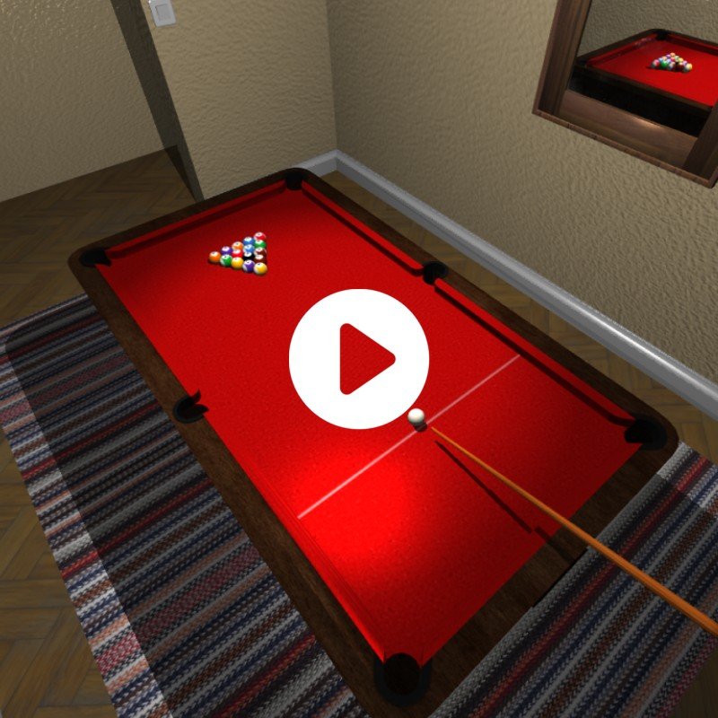

## INFO-H502 | Group C
___
# Virtual reality project


## Description

The project consists of a pool game implemented in C++ and OpenGL. The game therefore obviously includes the essential elements of a pool game, namely: a pool table, a cue and the balls. These elements are arranged in a room, itself covered by a skybox of a street environment. Since the focus was on the graphical aspect of the game, it was decided to keep the game itself simple. Indeed, the game controls available allow to play a solo game by manually performing the game actions usually associated with the pool game, i.e.: enabling/disabling the use of the pool cue, rotating the pool cue, adjusting the shooting power, shooting, resetting the cue ball position and resetting the game. 

<a href="https://youtu.be/jjjQOVE9fjw"></a>

The main features are the following :  
- A coherent room environment  
- A simple collision system  
- Mirror and windows  
- Bump mapping  
- Shadows  
- Various small mechanics  :
	- Controls for the cue  
	-  A light switch  

## Dependencies and Setup

The project uses the following submodules, included in the `3rdParty` directory.
- [glfw](https://github.com/glfw/glfw/tree/dd8a678a66f1967372e5a5e3deac41ebf65ee127) OpenGL Library
- [glm](https://github.com/g-truc/glm/tree/fc8f4bb442b9540969f2f3f351c4960d91bca17a) OpenGL Mathematics
- [stb](https://github.com/nothings/stb/tree/8b5f1f37b5b75829fc72d38e7b5d4bcbf8a26d55) Image Library

Therefore when cloning (or forking) the repository, use preferably :
```
git clone --recursive https://github.com/nicolasseznec/INFO-H502_GroupC_Project.git
```

The project is built using `CMake`.

## Usage

The user can move around in the scene and play the game using the control scheme displayed below, or access it from the game by pressing F1.

### Controls


___

## Images


___

## Authors and acknowledgment

### Third party assets

The 3D Models and textures used in this project are free and come from various artists listed below. They have however been modified to better fit the project.


**"Cozy Room"** - by  *Kless Gyzen*
Available at : https://www.turbosquid.com/fr/3d-models/cozy-room-3d-model-1641507

**"Pool Table"** - by *Pieter Ferreira*
Available at : https://skfb.ly/oyLXy is licensed under Creative Commons Attribution.

**"Bookcase"** - by *3D_for_everyone*
Available at : https://skfb.ly/oBUOJ is licensed under Creative Commons Attribution.

**"Mirror"** - by *listudio220 (Ivan)*
Available at : https://www.cgtrader.com/free-3d-models/furniture/other/manor-house-whitewashed-salvaged-boat-wood-leaner-mirror 

